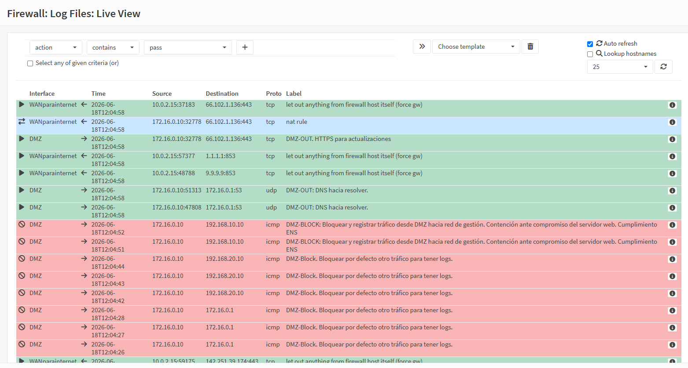
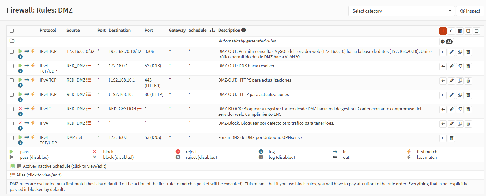
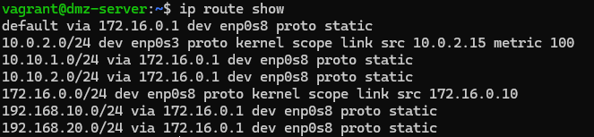

## 8. Verificación del control de tráfico por OPNsense

### 8.1 Cómo leer el Live View del firewall

El Live View de OPNsense es la herramienta principal para verificar en tiempo real el tráfico que atraviesa el firewall. Muestra cada paquete aceptado o bloqueado junto con la regla que lo procesó.

**Acceso al Live View:**

1. Conectarse a la WebUI de OPNsense mediante la VPN de administradores (sección 6.1).
2. Navegar a **Firewall → Log Files → Live View**.

**Columnas relevantes:**

| Columna | Significado |
|---------|-------------|
| **Action** | `pass` (permitido) o `block` (bloqueado) |
| **Interface** | Interfaz por la que entró el paquete (WAN, DMZ, VLAN20, etc.) |
| **Time** | Marca de tiempo del paquete |
| **Source** | IP de origen y puerto |
| **Destination** | IP de destino y puerto |
| **Proto** | Protocolo (TCP, UDP, ICMP, etc.) |
| **Label** | Descripción de la regla de firewall que procesó el paquete |

**Filtros útiles:**

- `Action = block` → solo tráfico denegado.
- `Interface = WAN` → solo tráfico entrante desde la red externa.
- `Destination = 172.16.0.10` → solo tráfico dirigido al servidor DMZ.



*Figura 2: Live View de OPNsense. Se observan paquetes bloqueados desde la IP 91.168.50.10 (external-kali) hacia recursos internos. La columna Label indica qué regla ha denegado el tráfico.*

---

### 8.2 Tráfico bloqueado desde WAN sin VPN

Para confirmar que el firewall bloquea correctamente los intentos de acceso no autorizados desde la WAN, se genera tráfico desde `external-kali` sin ninguna VPN activa y se observa en el Live View.

**Procedimiento:**

```bash
# Desde external-kali, sin VPN
curl --connect-timeout 5 http://172.16.0.10
ping -c 2 192.168.20.10
nmap -sS -p 22,80,443 91.168.50.1
```

**Observación en OPNsense (Live View):**

- Aparecen múltiples entradas con `Action = block`.
- La interfaz de entrada es `WAN`.
- La IP de origen es `91.168.50.10`.
- La regla que bloquea suele ser la regla por defecto (`Default deny / block rule`) o alguna de las reglas que hemos añadido a las interfaces para bloquear explícitamente tráfico.


*Figura 3: Detalle del Live View filtrado por Action=block. Se aprecian los intentos de conexión desde external-kali sin VPN hacia la DMZ y la VLAN de servidores, todos denegados y registrados.*

**Explicación:** La política de whitelisting aplicada en OPNsense fuerza a que solo el tráfico explícitamente autorizado, como las conexiones entrantes a los puertos WireGuard, sea permitido. Cualquier otro intento es descartado, cumpliendo con el principio de denegación por defecto exigido por el ENS.

---

### 8.3 Tráfico permitido y registrado por interfaz

Además de bloquear, OPNsense registra el tráfico permitido si las reglas tienen habilitada la opción de logging. Esto permite auditar tanto las comunicaciones legítimas como los intentos no autorizados.

**Verificación con VPN activa:**

```bash
# Desde external-kali, activar la VPN de usuarios
sudo wg-quick up wg-users
curl http://172.16.0.10
```

**En Live View (filtrar por Interface = VPN o por Source = 10.10.2.51):**

En el Live View, filtrando por Source = 10.10.2.51, aparecen entradas con Action = pass correspondientes a la regla que autoriza tráfico desde wg-users hacia la DMZ en el puerto 80. Los ejemplos concretos de logs para cada escenario se detallan en la sección 12.2



*Figura 4: Listado de reglas de la interfaz DMZ en OPNsense. Las reglas de bloqueo tienen el icono de logging activado, lo que garantiza que cualquier intento no autorizado quede registrado.*

**Explicación:** El logging por regla es esencial para la trazabilidad y la detección de incidentes. Cada regla de bloqueo relevante tiene habilitada la opción de logs, de modo que los intentos de acceso no autorizados aparezcan en los logs con la descripción de la regla que los bloqueó.

---

### 8.4 Verificación de que todo el tráfico de las VMs pasa por OPNsense

Se comprueba que las máquinas internas (`dmz-server` y `vlan20-server`) no tienen rutas alternativas a internet y que toda su comunicación con el exterior cursa a través de OPNsense.

**Prueba: Rutas por defecto**

```bash
# Desde dmz-server
ip route show default
# Debe devolver: default via 172.16.0.1 dev enp0s8

# Desde vlan20-server
ip route show default
# Debe devolver: default via 192.168.20.1 dev enp0s8
```



*Figura 5: Salida del comando `ip route show` en dmz-server. Se observa que la ruta por defecto apunta a `172.16.0.1` (OPNsense) y no a la red NAT de VirtualBox.*

**Conclusión:** Todo el tráfico de las máquinas internas hacia el exterior está forzado a pasar por OPNsense. Esto garantiza que las políticas de filtrado, el DNS forzado y la monitorización del IDS se apliquen sin posibilidad de bypass.

<br>
<table style="width: 100%; border: none;">
  <tr>
    <td style="text-align: left; border: none; padding: 0;">
      <a href="07-pruebas-funcionales.md">← Anterior</a>
    </td>
    <td style="text-align: center; border: none; padding: 0;">
      <a href="../README.md">Volver al índice</a>
    </td>
    <td style="text-align: right; border: none; padding: 0;">
      <a href="09-vpn-wireguard.md">Siguiente →</a>
    </td>
  </tr>
</table>
